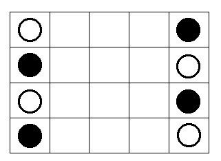

#### This project is a neural network that plays the game of Dynamic-Connect-3. 

##### DESCRIPTION
The game of "dynamic connect-3" is played on a 5x4 grid as follows: Starting from the initial position illustrated below, players take turns moving one piece of their colour by one square, either horizontally or vertically. White plays first. Pieces can only move to unoccupied squares. The winner is the first player to line up three of its pieces either horizontally, vertically, or diagonally. The threefold repetition rule applies to conclude a draw. 

Each square in the grid can be labeled by its <x,y> position, with 1,1 corresponding to the top-left square. Moves are entered by specifying the position of the piece to move in the form <x,y> followed by one of the compass directions, N, S, E, W. For example, to move the black piece at the bottom left of the board one square to the right, the command would be 14E.



##### DEPENDENCIES
* g++ (>= 4.6)
* boost (>= 1.53)
* make

##### BUILD
```
make
```

##### USAGE
```
Usage: ./main
	-H <hostname>   Hostname of gameserver. Default is localhost.
	-P <port>       Port of gameserver. Default is 12345.
	-a              Auto-mode. Play against itself.
	-b              Play as black. Default is white.
	-d <depth>      Max depth. Default is 8.
	-l              Use large board. Default is small board.
	-g              Generate states.
	-p <statemap>   Populate states
	-s <gameID>     Use game server. Default is false.
	-h              Display this help message.
```
